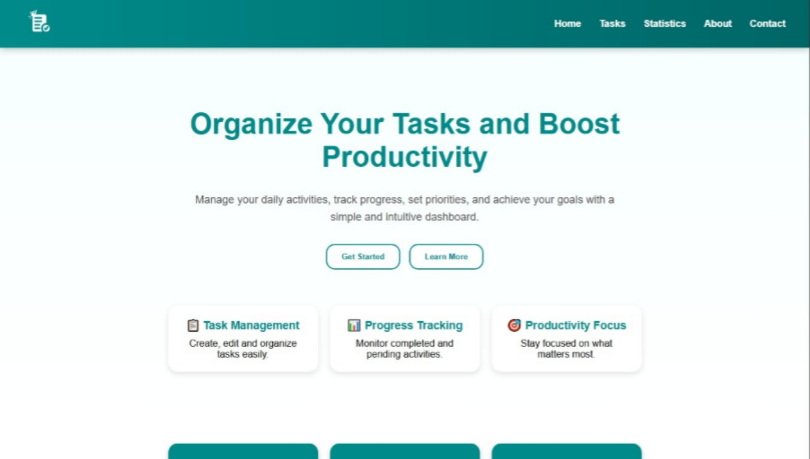

# 📋 Task Manager Dashboard

A modern and responsive task management dashboard developed with **HTML5** and **CSS3**.

The project was created to practice front-end development concepts such as page structure, responsive layouts, forms, tables, animations, and visual design.

---

## 🚀 Features

* Responsive navigation bar
* Custom logo integration
* Hero section with call-to-action buttons
* Task statistics cards
* Animated progress bar
* Task management table
* New task creation form
* About section
* Contact form
* Footer with social media links

---

## 🛠 Technologies Used

* HTML5
* CSS3
* Flexbox
* CSS Grid
* CSS Animations

---

## 📸 Preview



---

## 📂 Project Structure

```text
Task_Manager/
│
├── index.html
│
│
├── css/
│   └── style.css
│
├── assets/
│   └── images/
│       ├── logo.png
│
└── screenshots/
│       └── preview.jpeg
│
├── README.md
│
└── LICENSE
```

---

## 🎯 Learning Objectives

This project was developed to improve skills in:

* Semantic HTML
* CSS styling
* Layout organization
* Responsive design
* Component-based thinking
* Project structuring for GitHub portfolios

---

## 🔮 Future Improvements

* Add JavaScript functionality
* Create dynamic task management
* Store tasks using Local Storage
* Add Dark Mode
* Implement task filters
* Integrate a backend API
* User authentication system

---

## 🌐 Live Demo

https://mankelemes.github.io/task-manager-dashboard/

## 👨‍💻 Author

Developed by **Mateus Manke Lemes**

* GitHub: https://github.com/MankeLemes
* LinkedIn: https://www.linkedin.com/in/mateus-manke-lemes/

---

## 📄 License

This project is available for educational and portfolio purposes.
